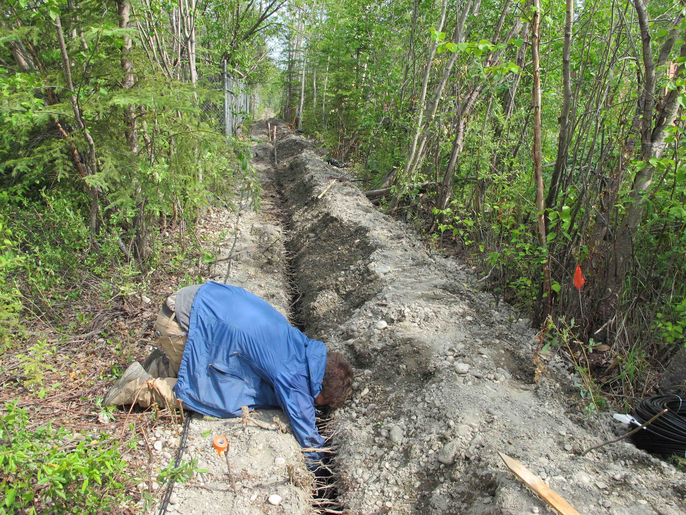

**2015 -**			-- Ph.D. in Geophysics, University of California, Berkeley
\\
**2012 - 2015** -- Senior Research Associate, Lawrence Berkeley National Laboratory
\\
**2011 - 2012** -- MSc. in Geophysics, University of Edinburgh
\\
**2006 - 2011** -- B.S. in Alternative Energy and Sustainable Engineering, University of Rochester
\\

I am currently a PhD student in the [Earth and Planetary Science Department](https://sites.agu.org/) at UC Berkeley, where I study Alaskan permafrost thaw, fluid-solid seafloor dynamics, and common anthropogenic noise sources with distributed fiber optic geophysics.
\\
\\
I am an affiliate of the [Berkeley Seismological Laboratory](https:http://seismo.berkeley.edu/) and [Lawrence Berkeley National Laboratory](http://www.lbl.gov/), and a member of the [American Geophysical Union](https://sites.agu.org/), [Society of Exploration Geophysicists](https://seg.org/), and [Bay Area Geophysical Society](http://bayareageophysicalsociety.org/).
\\
\\
I live in Oakland, CA
