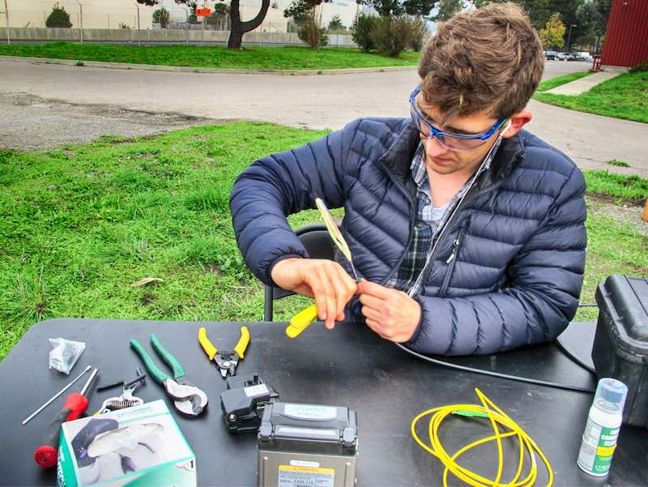

{:height="480px"}

[2017-Dec-08]  Science featured our work [this cheatsheet](http://ricostacruz.com/cheatsheets/markdown.html)
\\
[2017-Dec-08]  Smithsonian.com covered [this cheatsheet](http://ricostacruz.com/cheatsheets/markdown.html)
\\
[2016-Sep-15]  Nate installed a Guralp CMG-3T seismometer in Sacramento, CA as part of the FOSSA experiment
\\
[2017-Dec-08]  Physics Today covered [this cheatsheet](http://ricostacruz.com/cheatsheets/markdown.html)
\\
[2017-Dec-15]  Nate presented a poster at the AGU Fall Meeting in New Orleans...thanks for the travel grant PYRN!
\\
[2017-Dec-08]  Scientific American 60-second podcast covered [this cheatsheet](http://ricostacruz.com/cheatsheets/markdown.html)
\\
[2017-Dec-01]  'Fiber-Optic Network Observations of Earthquake Wavefields' published in Geophysical Research Letters
\\
[2017-Dec-08]  Fiber-Optic Seismology featured in the BSL [2016-2017 Annual Report](http://ricostacruz.com/cheatsheets/markdown.html)
\\
[2017-Sep-10]  Nate attended Geosciences Congressional Visits Day in Washington, DC
\\
[2017-Sep-15]  'Distributed Acoustic Sensing for Seismic Monitoring of The Near Surface: A Traffic-Noise Interferometry Case Study' published in Science Reports
\\
[2016-Sep-15]  Nate installed the Silixa iDAS in West Sacramento, CA as part of the FOSSA experiment
\\
[2017-Jul-23]  Nate presented a poster on permafrost thaw at the Critical Zone Observatory Meeting at Stanford University
\\
[2016-Apr-15]  Nate presented a white paper on DAS at the Cascadia Offshore Earthquake Early Warning Conference
\\
[2016-Dec-13]  Nate presented on DAS earthquake observations and permafrost thaw at the AGU Fall Meeting in San Francisco
\\
[2016-Sep-15]  Nate wrapped up the SERDP in situ permafrost thaw experiment in Fairbanks, Alaska...>10 cm of subsidence from 2 months!
