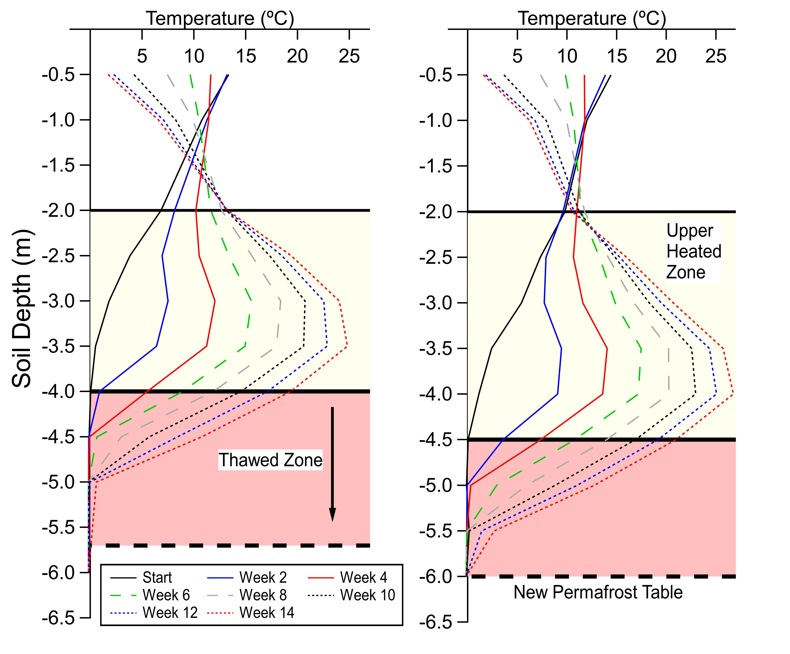

My research focuses on crustal process dynamics, curious signals, and emerging methodologies and tools.

## Dark Fiber-Optic Geophysics

Fiber-optic cables are everywhere (and becoming ubiquitous) offshore and in urban areas. Emerging distributed fiber-optic tools are transforming these cables into dense arrays of sensors that can be used to make array measurements of acoustic, temperature, and strain fields. Our group is using these methods to study permafrost degradation in Alaska, oceanography and the seismo-acoustic coupling of the ocean and the solid earth, and seismic event detection.
\\
\\
**Dark fiber exploration in monterey bay**
\\

**Seismic event detection**
\\

**Instrument sensitivity of DAS at f<1 Hz**
\\

**Vehicules as seismic sources**
\\
\\
\\
\\

## Permafrost Thaw Dynamics & Hazard

I have used DAS to study earthquakes at local to teleseismic distances, seismic wave propagation, anthropogenic noise sources such as vehicles and trains, and the permafrost thaw process. I have also focused on understanding the sensitivity of the DAS instrument, specifically to signals that are relevant to earth scientists (frequency=0.02 - 1 Hz), which enables application of DAS to measurements of geodetic phenomena.  which I have applied to study long-term permafrost thaw warming and permafrost degradation for the purposes of monitoring infrastructure and buildings for evolving permafrost thaw hazards.
\\

## Earthquake Source Physics
Lorem ipsum dolor sit amet, consectetur adipiscing elit. Integer luctus molestie libero id blandit. Ut condimentum urna eget cursus scelerisque. Proin bibendum finibus urna.
\\
\\
\\
\\

## Magnetotelluric Imaging of Geothermal Systems
Natural electric and magnetic fields, measured at the surface of the Earth, provide important information about the planet's interior conductivity structure. Magnetotellurics is the sector of geophysics that records these signals and models these structures, often in complement to the work of seismologists and other potential fields geophysicists. My work in this area focuses on the use of MT to study the roots of geothermal systems in Ethiopia, Iceland, the Western United States (Raft River, ID DOE Enahanced Geothermal System experiment and Coso Geothermal Field, CA), and the Taupo Volcanic Zone in New Zealand. I am interested in heat and mass transfer in geothermal systems, and new methods that allow us to improve our understanding of the geophysical field relationships that may result.
\\
\\
\\
